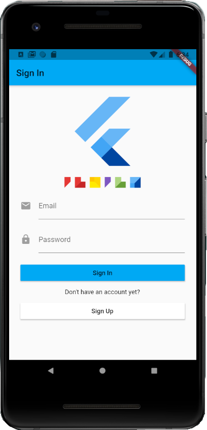
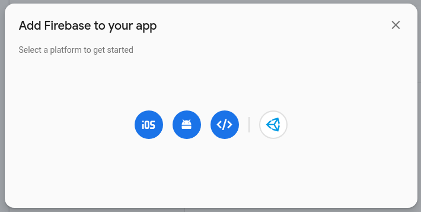
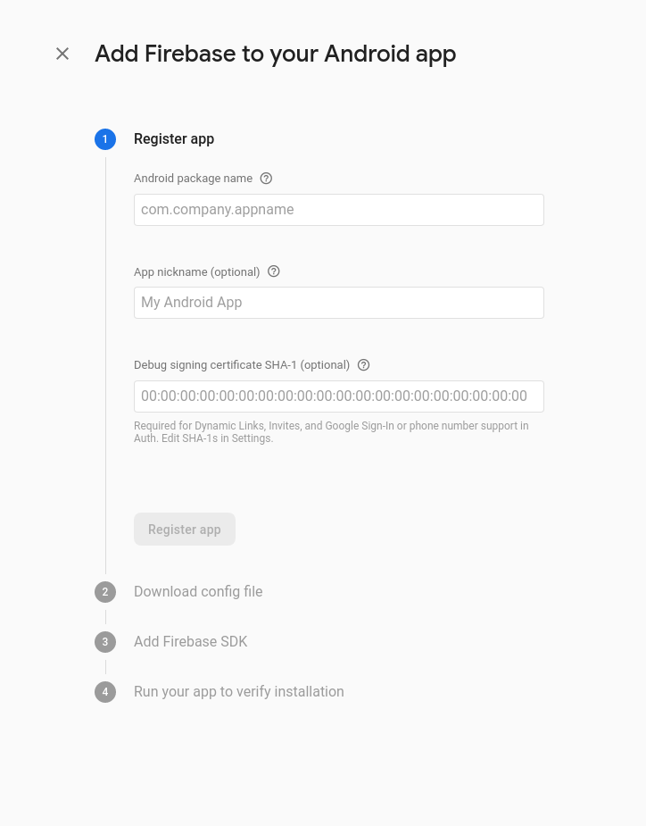
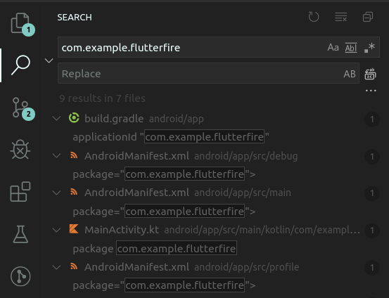

# FlutterFire

A basic Flutter app with Firebase (Android only).

 

## Getting Started

To create a fresh project. Clone this repository and complete the integration of Firebase into your project. Follow these guides below for Android to create your own config file.

1. Add an app to your existing project and select Android.
 
2. Fill in the necessary credentials and download the `google-services.json`
 
3. Replace `android/app/google-services.json` with your own config file.
4. Replace all `com.example.flutterfire` variables in your project with your own package name.
 
5. Press F5 in VSCode to start debugging with live reload.

